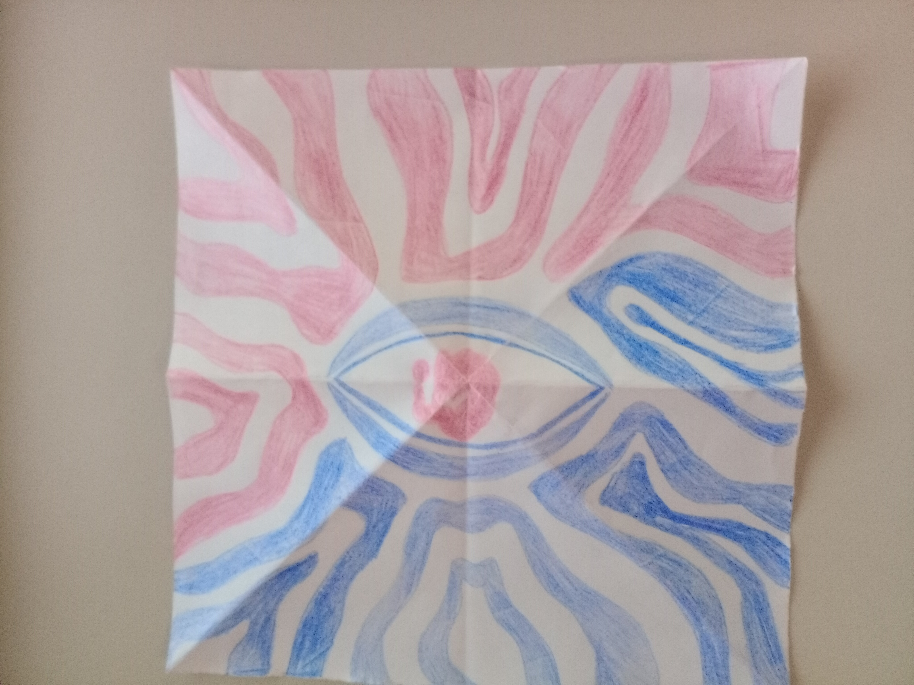
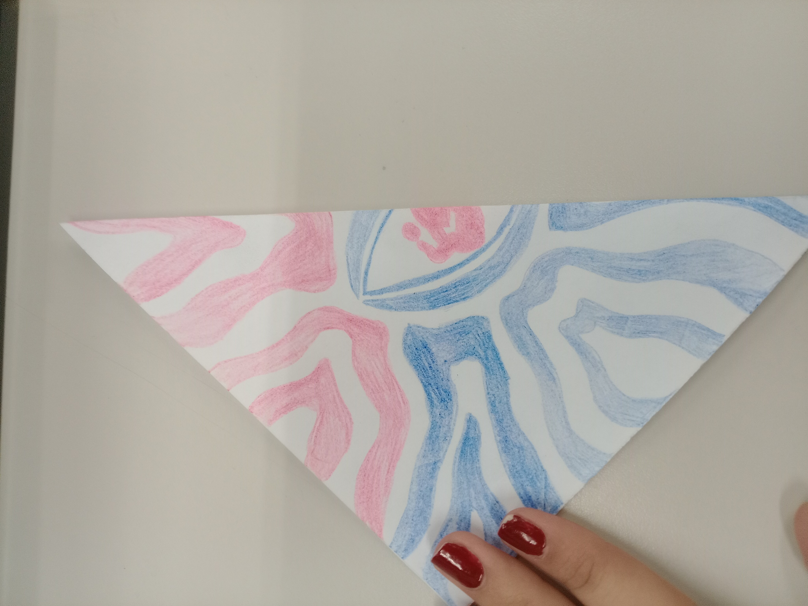
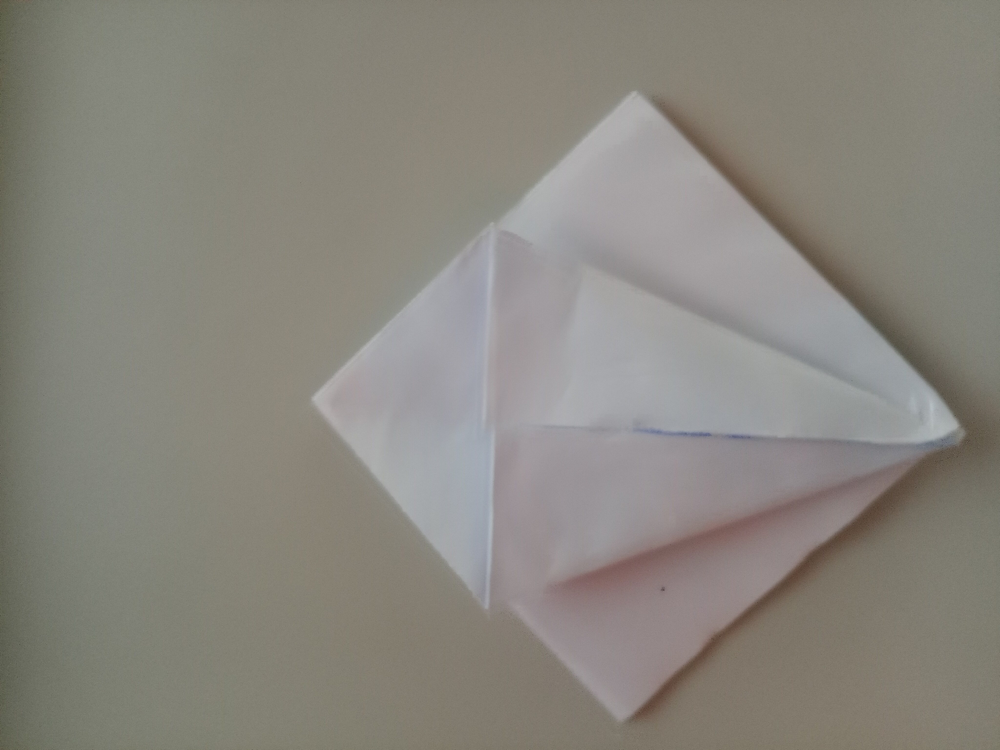
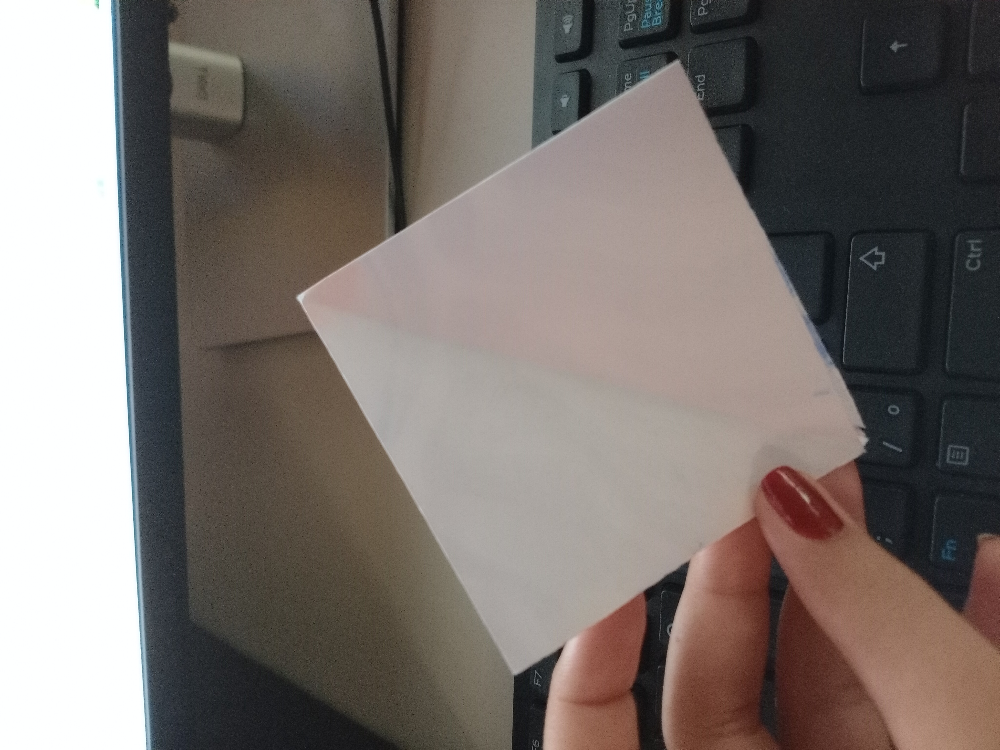
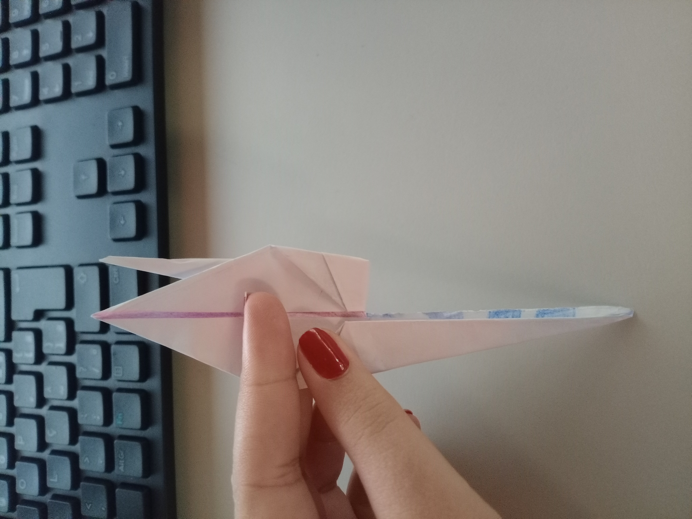
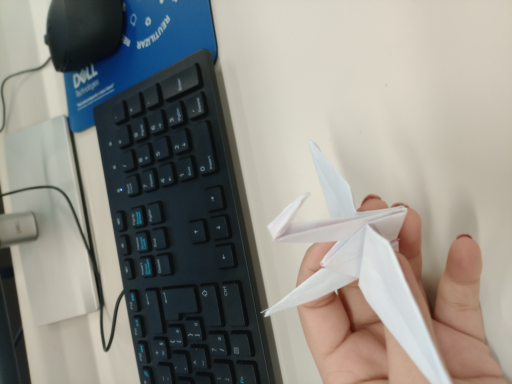

# Como Fazer um Tsuru 

## Materiais Necessários

- 1 folha de papel quadrado (15x15 cm é o tamanho tradicional)
- Superfície plana para dobrar

## Passo a Passo

### 1. Dobre na diagonal
Dobre o papel na diagonal em ambas as direções e depois desdobre. Isso criará um X nas dobras.

### 2. Dobre ao meio
Dobre o papel ao meio (horizontal e verticalmente), criando uma cruz. Depois desdobre.

### 3. Forme um quadrado base (base bomba d'água)
- Com os vincos prontos, junte as pontas e dobre o papel formando um quadrado menor com duas abas abertas na parte inferior.

### 4. Dobre as bordas
- Com a ponta fechada para cima, dobre os dois lados ao centro formando um "papagaio".
- Dobre a aba superior para baixo seguindo o vinco das laterais.
- Desdobre tudo e repita no outro lado.
### 5. Faça a base do tsuru (base da ave)
- Levante uma aba inferior e dobre pelas linhas já feitas, puxando as pontas laterais para dentro.
- Achate para formar um losango. Faça o mesmo no verso.
### 6. Forme o pescoço e o rabo
- Pegue as abas inferiores e dobre-as para cima, criando o pescoço e o rabo da ave.

### 7. Forme as asas
- Dobre as abas superiores para baixo (horizontalmente) para formar as asas.

### 8. Modele a cabeça
- Escolha uma das pontas (pescoço) e dobre a ponta para baixo, formando a cabeça do tsuru. A FOTO É UM PEQUENO RESUMO DOS PASSOS ANTERIORES!

## Dica Final

Puxe levemente as asas para dar volume ao corpo e deixar o tsuru em pé.

---

**Parabéns!** Você criou um tsuru de origami. 
